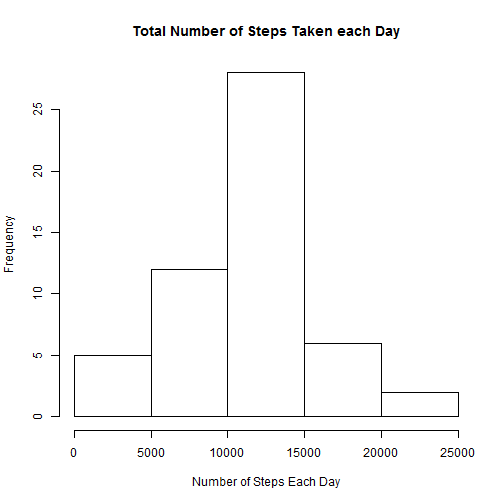
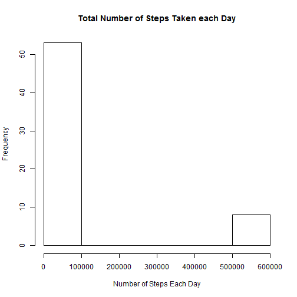
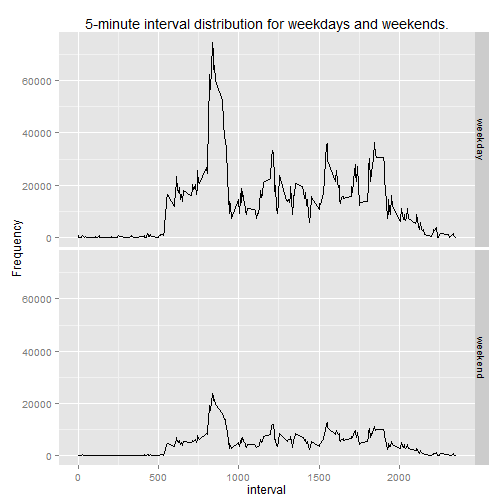

## Introduction

This is the first Peer Asignment for the Reproducible Research course on Coursera.

It is now possible to collect a large amount of data about personal movement using activity monitoring devices such as a Fitbit, Nike Fuelband, or Jawbone Up. These type of devices are part of the "quantified self" movement - a group of enthusiasts who take measurements about themselves regularly to improve their health, to find patterns in their behavior, or because they are tech geeks. But these data remain under-utilized both because the raw data are hard to obtain and there is a lack of statistical methods and software for processing and interpreting the data.

This assignment makes use of data from a personal activity monitoring device. This device collects data at 5 minute intervals through out the day. The data consists of two months of data from an anonymous individual collected during the months of October and November, 2012 and include the number of steps taken in 5 minute intervals each day.

```r
library(data.table)
library(timeDate)
library(ggplot2)
```


```r
activity_raw = read.csv("activity.csv")
activity_raw[[2]] = as.Date(activity_raw[[2]])
options(scipen=999)
```

### What is mean total number of steps taken per day?

We're going to read the dataset, convert it to data table and do the aggregations
needed to plot the data.


```r
activity_dt = data.table(activity_raw)
activity_dt = activity_dt[!is.na(steps),sum(steps), by = list(date)]
activity_df = data.frame(activity_dt)
colnames(activity_df) = c("date", "steps")
```

1. Make a histogram of the total number of steps taken each day


```r
hist(as.integer(activity_dt$V1), xlab = "Number of Steps Each Day", main = "Total Number of Steps Taken each Day")
```

 


2. Calculate and report the mean and median total number of steps taken per day
Mean:

```r
print(mean(activity_df$steps), na.rm = T)
```

```
## [1] 10766
```
Median:

```r
print(median(activity_df$steps), na.rm = T)
```

```
## [1] 10765
```

### What is the average daily activity pattern?
Here, we're going to aggregate the data frame by 5-minute day interval and plot the resulting data set.


```r
avg_dt = data.table(activity_raw)
avg_dt = avg_dt[!is.na(steps), sum(ave(steps)), by = list(interval)]
```

1. Make a time series plot (i.e. type = "l") of the 5-minute interval (x-axis) and the average number of steps taken, averaged across all days (y-axis)


```r
with(avg_dt, plot(interval, V1, ylab = "Steps", type = "l", main = "Average Steps by Day Interval"))
```

 


2. Which 5-minute interval, on average across all the days in the dataset, contains the maximum number of steps?


```r
avg_dt[which.max(avg_dt[[2]]),interval]
```

```
## [1] 835
```

## Imputing missing values

Note that there are a number of days/intervals where there are missing values (coded as NA). The presence of missing days may introduce bias into some calculations or summaries of the data.

1. Calculate and report the total number of missing values in the dataset (i.e. the total number of rows with NAs)


```r
print(length(which(is.na(activity_raw$steps))))
```

```
## [1] 2304
```

2. Devise a strategy for filling in all of the missing values in the dataset.

We're going to use again the avg_dt data table again, to fill the NA with the mean of that interval.

3. Create a new dataset that is equal to the original dataset but with the missing data filled in.


```r
filled_dt = data.table(activity_raw)
for (i in 1:length(filled_dt$steps)){
        if(is.na(filled_dt[i,steps])){
                filled_dt[i,1] = as.integer(avg_dt[interval == 
                        filled_dt[i,interval], V1])  
        }
}
```

4. Make a histogram of the total number of steps taken each day


```r
filled_day_dt = filled_dt[!is.na(steps),sum(steps), by = list(date)]
hist(as.integer(filled_day_dt$V1), xlab = "Number of Steps Each Day", main = "Total Number of Steps Taken each Day")
```

 

5. Calculate and report the mean and median total number of steps taken per day.


```r
filled_day_df = data.frame(filled_day_dt)
colnames(filled_day_df) = c("date", "steps")
```

Mean:

```r
print(mean(filled_day_df$steps), na.rm = T)
```

```
## [1] 84187
```
Median:

```r
print(median(filled_day_df$steps), na.rm = T)
```

```
## [1] 11458
```

These values differ from the first ones because we filled each of the missing values in the dataset. This cause the histogram to polarize when summing the frequency of the number of steps.


### Are there differences in activity patterns between weekdays and weekends?

1. Create a new factor variable in the dataset with two levels - "weekday" and "weekend" indicating whether a given date is a weekday or weekend day.

We're going to first check if the day is on a weekday or on a weekend. Then we're going to assign the factor variables.


```r
week_df = data.frame(filled_dt)
week_df$type_day = as.factor(ifelse(isWeekday(week_df$date), "weekday", "weekend"))
```

2. Make a panel plot containing a time series plot of the 5-minute interval and the average number of steps taken, averaged across all weekday days or weekend days.

For this one, we're going to aggregate the dataset by interval and type of day (weekend or weekday). Then plot the results divided by type of day.


```r
avg_week_dt = data.table(week_df)
avg_week_dt = avg_week_dt[!is.na(steps), sum(ave(steps)), by = list(interval, type_day)]

ggplot(avg_week_dt, aes(x= interval, y = V1))+ geom_line() + facet_grid(type_day ~ .) + ylab("Frequency") + ggtitle("5-minute interval distribution for weekdays and weekends.")
```

 
